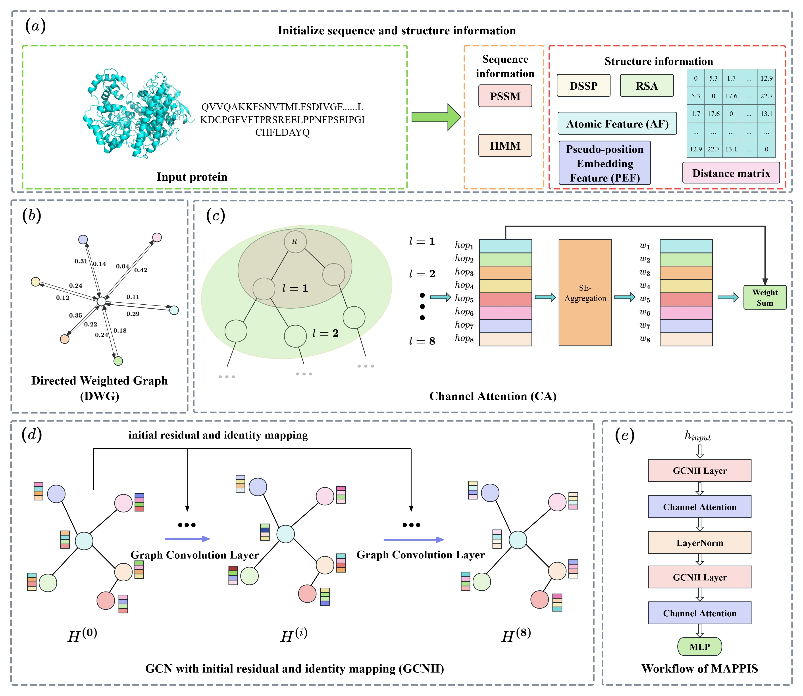

<div align="center">
  <h1>MAPPIS：Efficient and Fast Multi-dimension Attention Protein-Protein Interaction Site Prediction</h1>
</div>
  

## Introduction
(a) Input a protein's 3D structure and its amino acid sequence. Extract sequence information and structural information.    
(b) Construct a directed weighted graph, where each node represents a residue, each edge represents the connection between nodes, and the weight indicates the strength of the connection.  
(c) Apply a channel attention mechanism to assign attention weights to features propagated from different layers (hop distances). The SE-Aggregation (Squeeze-and-Excitation) module is used to aggregate neighbor information across different hops and learn their corresponding importance weights 𝑤1,𝑤2,...,𝑤8, which are then combined through a weighted sum.  
(d) Employ a graph convolutional neural network (GCN) with the incorporation of Initial Residual Connections and Identity Mapping.  
(e) Overall Workflow of MAPPIS  

## Dependency
```markdown
python                    3.10.18
dgl                       2.2.1
freesasa                  2.2.1
matplotlib                3.10.0
numpy                     2.1.2
pandas                    2.3.1
scikit-learn              1.6.1
torch                     2.3.0
torch-cluster             1.6.3
torch-geometric           2.5.0
torch-scatter             2.1.2
torch-sparse              0.6.18
torch-spline-conv         1.2.2
torchaudio                2.3.0
torchdata                 0.8.0
torchvision               0.18.0
```
## Dataset

## Train and Test

### Train
start training
if use AttPreSite_model.py
```markdown
python AttPreSite_model.py
```
output
```markdown
./Model/fold1_best_model.pkl
./Model/fold2_best_model.pkl
...
./Model/full_model_30.pkl
```

if use AttPreSite-Ligand_model.py
```markdown
python AttPreSite-Ligand_model.py --ligand RNA --trans
```
output
```markdown
./Model/fold1_best_model.pkl
./Model/fold2_best_model.pkl
...
./Model/full_model_30.pkl
```

### Test
start testing
if use AttPreSite_model.py
```markdown
python AttPreSite_model.py
```
output
```markdown
Test_60:
Test loss:  0.35188861563801765
Test binary acc:  0.8532410225197808
Test precision: 0.5292
Test recall:  0.6375903614457832
Test f1:  0.5783606557377049
Test AUC:  0.8730095882672436
Test AUPRC:  0.5954371390159193
Test mcc:  0.49356660367384997
Threshold:  0.29

Test_315-28:
Test loss:  0.3352209431109528
Test binary acc:  0.8613687557970054
Test precision: 0.50909428359317
Test recall:  0.6404389446649544
Test f1:  0.5672629510908903
Test AUC:  0.881639916372179
Test AUPRC:  0.5846846871636862
Test mcc:  0.4905450545869246
Threshold:  0.4

BTest_31:
Test loss:  0.3097736287501551
Test binary acc:  0.8623839244938347
Test precision: 0.48627450980392156
Test recall:  0.713463751438435
Test f1:  0.5783582089552238
Test AUC:  0.8915595663497061
Test AUPRC:  0.6005335030075699
Test mcc:  0.5127453818159148
Threshold:  0.17

BTest_31-6:
Test loss:  0.29347263753414154
Test binary acc:  0.8743178717598908
Test precision: 0.5009505703422054
Test recall:  0.713125845737483
Test f1:  0.588498045784478
Test AUC:  0.8971802369715172
Test AUPRC:  0.60762077430879
Test mcc:  0.5282226538371553
Threshold:  0.17

UBtest_31-6:
Test loss:  0.3668563061952591
Test binary acc:  0.8299814094980564
Test precision: 0.36176194939081535
Test recall:  0.5428973277074542
Test f1:  0.4341957255343082
Test AUC:  0.8118437397506826
Test AUPRC:  0.4116572608571926
Test mcc:  0.3485157642515198
Threshold:  0.18
```

if use AttPreSite-Ligand_model.py
```markdown
python AttPreSite-Ligand_model.py --ligand RNA --trans
```
output
```markdown
DNA-Test_129:
Test loss:  0.17306546022205851
Test binary acc:  0.9235505797680927
Test precision: 0.41608765366114375
Test recall:  0.6950892857142857
Test f1:  0.5205616850551655
Test AUC:  0.932489375569505
Test AUPRC:  0.5233944364174145
Test mcc:  0.5006401050722077
Threshold:  0.32
```
<div style="display: flex; justify-content: space-between; gap: 10px;">
  
  
</div>  
